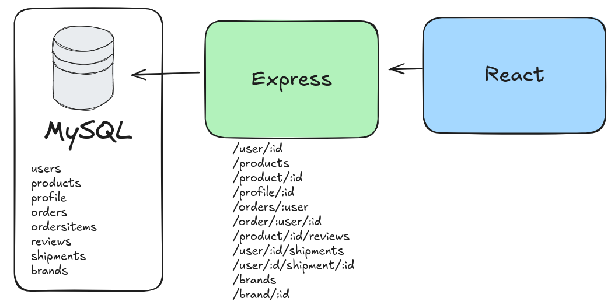

# express-project

## Clothes app

Clothing app allows users to discover their next favorit clothes.



# Objectives:

- [ ] Landing page
- [ ] Dashboard
- [ ] 6 tables
- [ ] Api 


<https://medium.com/@deivisonisidoro_94304/revolutionizing-software-development-unveiling-the-power-of-clean-architecture-with-typescript-5ee968357d35>

## UI Library

<https://www.radix-ui.com/>

## Structure

```src/
    backend/
        entity/
            domain/ -- imports from itself -- rarely change
                entities/
                value-objects/
            app/  -- imports from domain -- sometimes changes
                use-case-implementations/
                integrations/
            infra/ -- imports from application -- constantly change
                persistance/
```